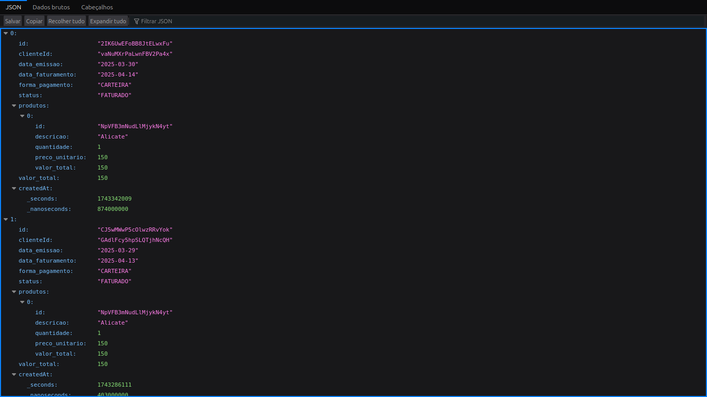
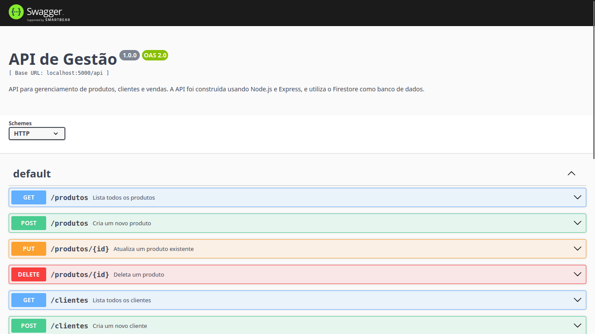

# Sistema de Gerenciamento para Automec

Esta é uma API para gerenciamento de produtos, clientes e vendas. A API foi construída usando Node.js e Express, e utiliza o Firestore como banco de dados. A documentação da API é gerada automaticamente usando o Swagger UI.

## Índice

- [Tecnologias Utilizadas](#tecnologias-utilizadas)
- [Instalação](#instalação)
- [Uso](#uso)
- [Endpoints da API](#endpoints-da-api)
- [Contribuição](#contribuição)
- [Licença](#licença)

## Tecnologias Utilizadas

- Node.js
- Express
- Firestore (Firebase)
- Swagger UI
- CORS

## Instalação

1. **Clone o repositório**:
   git clone https://github.com/jonatasem/server-automec.git
   cd server-automec

2. **Instale as dependências**:
   npm install
   
3. **Crie um arquivo `.env`** na raiz do projeto e adicione suas credenciais do Firebase:

   FIREBASE_PROJECT_ID='seu-projeto-id'
   PORT=5000
   FIREBASE_CREDENTIALS='{"type": "service_account", ...}'
   
4. **Inicie o servidor**:
   npm start
   
O servidor estará rodando em `http://localhost:5000`.

## Uso

Acesse a documentação da API através do Swagger UI em `http://localhost:5000/api-docs`.

## Endpoints da API

### Clientes

- `GET /api/clientes`: Lista todos os clientes.
- `POST /api/clientes`: Cria um novo cliente.
- `PUT /api/clientes/:id`: Atualiza um cliente existente.
- `DELETE /api/clientes/:id`: Deleta um cliente.

### Produtos

- `GET /api/produtos`: Lista todos os produtos.
- `POST /api/produtos`: Cria um novo produto.
- `PUT /api/produtos/:id`: Atualiza um produto existente.
- `DELETE /api/produtos/:id`: Deleta um produto.

### Vendas

- `GET /api/vendas`: Lista todas as vendas.
- `POST /api/vendas`: Cria uma nova venda.
- `PUT /api/vendas/:id`: Atualiza uma venda existente.
- `DELETE /api/vendas/:id`: Deleta uma venda.

## Licença

Este projeto está licenciado sob a MIT License. Veja o arquivo [LICENSE](LICENSE) para mais detalhes.
